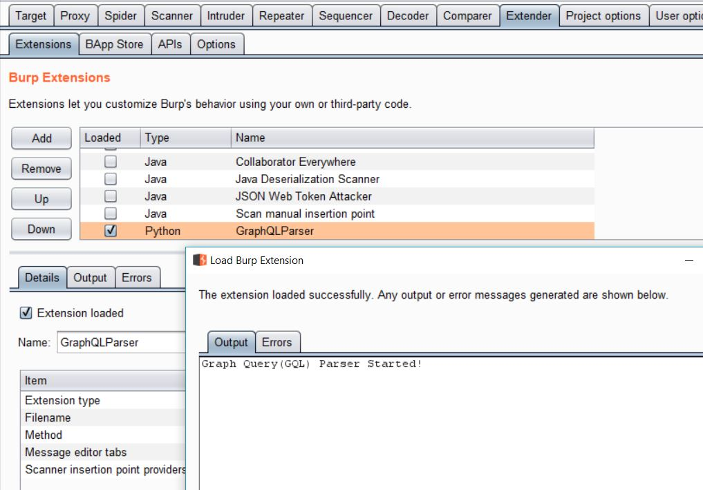
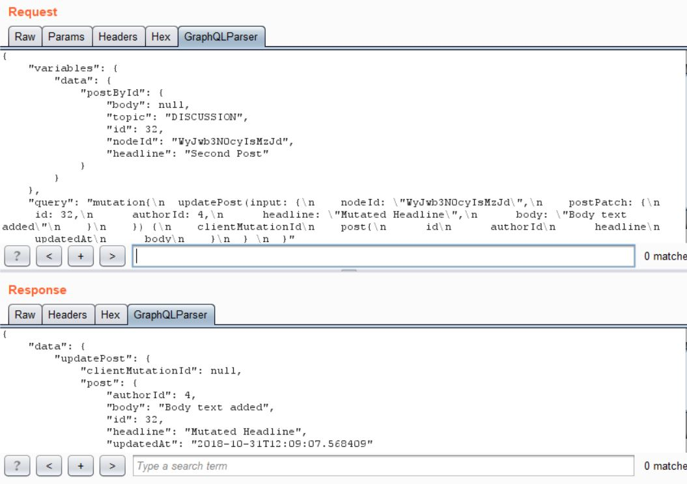

## Graph Query Parser & Editor
*A repository for Graph Query Extension for Burp Suite*

**Requirements:**
---------------------
You will need the below to get started:

  -The latest version of Burp(Tested for Burp 1.7.37 and above)
  
  -A Jython standalone Jar file (jython-standalone-2.7.0.jar or above) 
  To be added to Extender > Options > Python Environment
  
**Manual Installation:**
------------------
1. 'Extender'->'Options'
2. Click 'Select file' under 'Python environment'
3. Choose jython-standalone-2.7.0.jar
4. 'Extender'->'Extensions'
5. Click 'Add'
6. Change 'Extension Type' to Python
7. Choose GraphQLParser.py. Add queryProcess.py to the same folder.

Done!

Once the GQLParser is successfully loaded and activated, it looks like this:





**Usage Notes:**
----------------
To invoke the GraphQLParser follow the steps given in 'Manual Installation'. Once the parser is selected, go to 'HTTP Proxy' and browse the requests. The parser automatically detects the requests being sent to a GraphQL endpoint and the GraphQLParser Tab gets activated. 

A sample original GraphQL query request will look like below in Burp request panel:
```
POST /graphql HTTP/1.1
Host: 127.0.0.1:9999
User-Agent: Mozilla/5.0 (Windows NT 10.0; Win64; x64; rv:63.0) Gecko/20100101 Firefox/63.0
Accept: application/json
Accept-Language: en-US,en;q=0.5
Accept-Encoding: gzip, deflate
Referer: http://127.0.0.1:9999/graphiql
content-type: application/json
Content-Length: 473


{"query":"mutation{\n  updatePost(input: {\n    nodeId: \"WyJwb3N0cyIsMzJd\",\n    postPatch: {\n      id: 32,\n      authorId: 4,\n      headline: \"Mutated Headline\",\n      body: \"Body text added\"\n    }\n    }) {\n    clientMutationId\n    post{\n      id\n      authorId\n      headline\n      updatedAt\n      body\n    }\n  } \n  }","variables":{"data":{"postById":{"nodeId":"WyJwb3N0cyIsMzJd","id":32,"topic":"DISCUSSION","headline":"Second Post","body":null}}}}

```
The tester now has a hectic job of searching the input fields for injecting their payloads. No more!

With GraphQLParser loaded, this request now shows the dynamic user input parameters at the top alongside a structured query below for the tester such as:
```
{
    "variables": {
        "data": {
            "postById": {
                "body": null, 
                "topic": "DISCUSSION", 
                "id": 32, 
                "nodeId": "WyJwb3N0cyIsMzJd", 
                "headline": "Second Post"
            }
        }
    }, 
    "query": "mutation{\n  updatePost(input: {\n    nodeId: \"WyJwb3N0cyIsMzJd\",\n    postPatch: {\n      id: 32,\n      authorId: 4,\n      headline: \"Mutated Headline\",\n      body: \"Body text added\"\n    }\n    }) {\n    clientMutationId\n    post{\n      id\n      authorId\n      headline\n      updatedAt\n      body\n    }\n  } \n  }"
}

```
To tamper a GraphQL request, goto the raw request and Right-click to send to Repeater. Goto GraphQLParser tab and edit the Graph Query to inject your payload to the relevant input fields. Once done select 'Go' to send the query. This submits the tampered request successfully such as below:


GraphQLParser.py

Planned Improvements:
--------
- [x]  Detect & Parse GraphQL queries
- [x]  Integrate with Burp's Scanner
- [ ]  Facilitate integer scanning
- [ ]  Optimise the Scanner to reduce/minimize Bad Requests
- [ ]  Improve parser for further cascading
- [ ]  Add Core GraphQL Vulnerability Scanning

In Progress..
--------
It is still a work in progress so their may be a few issues. If you find anything during testing please DM me on my twitter: @NeeluTripathy
