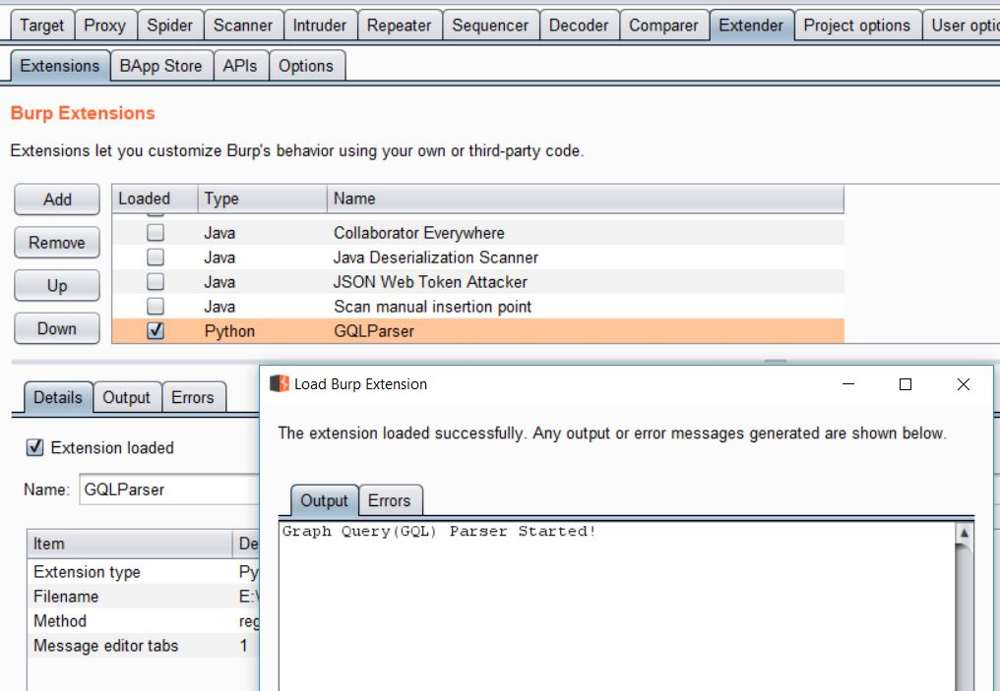
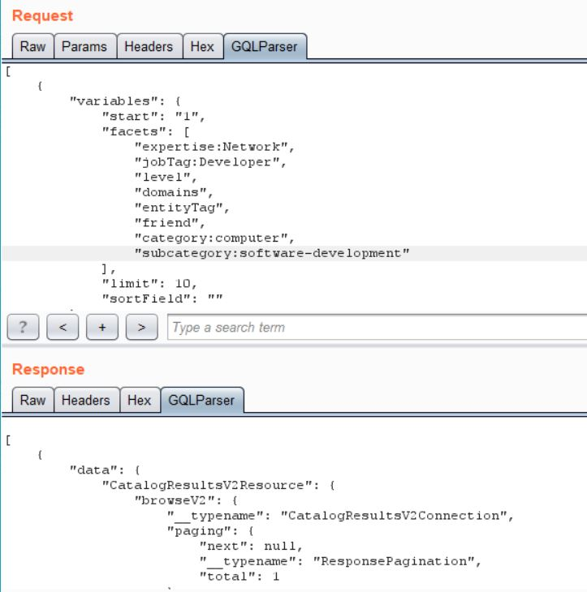

## Graph Query Parser & Editor
*A repository for Graph Query Extension for Burp Suite*

**Requirements:**
---------------------
You will need the below to get started:

  -The latest version of Burp(Tested for Burp 1.7.37 and above)
  
  -A Jython standalone Jar file (jython-standalone-2.7.0.jar or above) 
  To be added to Extender > Options > Python Environment
  
**Manual Installation:**
------------------
1. 'Extender'->'Options'
2. Click 'Select file' under 'Python environment'
3. Choose jython-standalone-2.7.0.jar
4. 'Extender'->'Extensions'
5. Click 'Add'
6. Change 'Extension Type' to Python
7. Choose GQLParser.py and Done!

Once the GQLParser is successfully loaded and activated, it looks like this:





**Usage Notes:**
----------------
To invoke the GQLParser follow the steps given in 'Manual Installation'. Once the parser is selected, go to 'HTTP Proxy' and browse the requests. The parser automatically detects the requests being sent to a GraphQL endpoint and the GQLParser Tab gets activated. 

A sample original GraphQL query request will look like below in Burp request panel:
```
POST /graphql HTTP/1.1
Host: api.webapp.data
Accept: */*
Accept-Language: en-US,en;q=0.5
Accept-Encoding: gzip, deflate
content-type: application/json
origin: https://api.webapp.data
Content-Length: 1051


{"query":"query routes_FieldPopup_Query(\n  $projectName: String!\n  $modelName: String!\n  $fieldName: String!\n  $fieldExists: Boolean!\n) {\n  viewer {\n    ...FieldPopup_viewer\n    id\n  }\n}\n\nfragment FieldPopup_viewer on Viewer {\n  model: modelByName(projectName: $projectName, modelName: $modelName) {\n    id\n    itemCount\n  }\n  field: fieldByName(projectName: $projectName, modelName: $modelName, fieldName: $fieldName) @include(if: $fieldExists) {\n    isUnique\n    id\n    typeIdentifier\n    description\n    isRequired\n    isList\n    name\n    isSystem\n    defaultValue\n    enum {\n      id\n    }\n    relation {\n      id\n    }\n    reverseRelationField {\n      name\n      id\n    }\n  }\n  project: projectByName(projectName: $projectName) {\n    id\n    isGlobalEnumsEnabled\n    enums(first: 1000) {\n      edges {\n        node {\n          id\n          name\n          values\n        }\n      }\n    }\n  }\n}\n","variables":{"projectName":"Example Project","modelName":"State","fieldName":"","fieldExists":false}}

```
The tester now has a hectic job of searching the input fields for injecting their payloads. No more!

With GQLParser loaded, this request now shows the dynamic user input parameters at the top alongside a structured query below for the tester such as:
```
{
    "variables": {
        "fieldExists": false, 
        "fieldName": "", 
        "modelName": "State", 
        "projectName": "Example Project"
    }, 
    "query": "query routes_FieldPopup_Query(\n  $projectName: String!\n  $modelName: String!\n  $fieldName: String!\n  $fieldExists: Boolean!\n) {\n  viewer {\n    ...FieldPopup_viewer\n    id\n  }\n}\n\nfragment FieldPopup_viewer on Viewer {\n  model: modelByName(projectName: $projectName, modelName: $modelName) {\n    id\n    itemCount\n  }\n  field: fieldByName(projectName: $projectName, modelName: $modelName, fieldName: $fieldName) @include(if: $fieldExists) {\n    isUnique\n    id\n    typeIdentifier\n    description\n    isRequired\n    isList\n    name\n    isSystem\n    defaultValue\n    enum {\n      id\n    }\n    relation {\n      id\n    }\n    reverseRelationField {\n      name\n      id\n    }\n  }\n  project: projectByName(projectName: $projectName) {\n    id\n    isGlobalEnumsEnabled\n    enums(first: 1000) {\n      edges {\n        node {\n          id\n          name\n          values\n        }\n      }\n    }\n  }\n}\n"
}

```
To tamper a GraphQL request, goto the raw request and Right-click to send to Repeater. Goto GQLParser tab and edit the Graph Query to inject your payload to the relevant input fields. Once done select 'Go' to send the query. This submits the tampered request successfully such as below:


In Progress..
--------
It is still a work in progress so their may be a few issues. If you find anything during testing please DM me on my twitter: @NeeluTripathy
